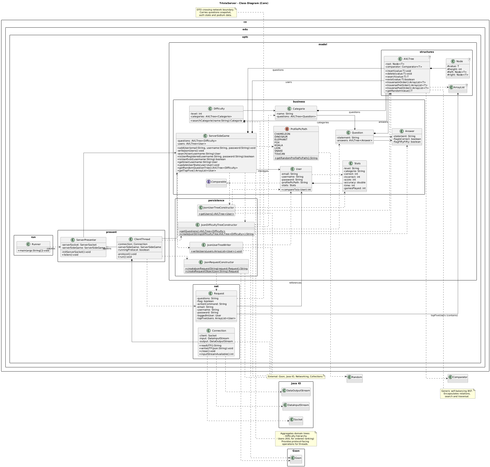

<h1 align="center">TriviaServer</h1>
<p align="center">
Server-side engine for a multiplayer Trivia Game: user authentications, question delivery, scoring, podium statistics and state persistence over a simple UTF JSON socket protocol.
</p>

---

<h2 align="left">Index</h2>

- [Overview](#overview)
- [Tech Stack](#tech-stack)
- [UML Class Model](#uml-class-model)
- [Core Packages](#core-packages)
- [Request / Response Protocol](#request--response-protocol)
  - [Action Commands](#action-commands)
  - [Request Object (Fields)](#request-object-fields)
- [Data Model \& Structures](#data-model--structures)
  - [Users (`resources/data/users.json`)](#users-resourcesdatausersjson)
  - [Questions (`resources/data/questions.json`)](#questions-resourcesdataquestionsjson)
- [Lifecycle](#lifecycle)
- [Build \& Run](#build--run)
  - [Prerequisites](#prerequisites)
  - [Compile](#compile)
  - [Run](#run)
  - [Client Requirements](#client-requirements)
- [Extensibility Ideas](#extensibility-ideas)
- [Author](#author)
- [License](#license)

## Overview

`TriviaServer` is a lightweight Java socket server that:

1. Loads users and question banks from JSON resources at startup.
2. Normalizes them into in‑memory domain structures (AVL trees for balanced question retrieval by difficulty / category).
3. Exposes a minimal JSON request/response protocol over a TCP socket using UTF frames.
4. Authenticates / registers users, serves random questions, updates statistics and produces a live podium (top five users by score).

Design goal: educational clarity over framework abstraction.

## Tech Stack

- Java 17.
- Gson.
- Raw TCP Sockets.
- AVL Trees.

## UML Class Model

[](https://raw.githubusercontent.com/danieltorrez29/TriviaServer/refs/heads/master/resources/images/diagrams/trivia_server_class_diagram.png)

## Core Packages

| Package | Responsibility |
|---------|----------------|
| `co.edu.uptc.run` | Entry point (`Runner`). |
| `co.edu.uptc.present` | Thread & connection orchestration (`ServerPresenter`, `ClientThread`). |
| `co.edu.uptc.net` | Transport primitives (`Connection`, `Request`). |
| `co.edu.uptc.model.business` | Domain logic: users, questions, stats, selection. |
| `co.edu.uptc.model.persistence` | JSON (de)serialization helpers (Gson). |
| `co.edu.uptc.model.structures` | Custom data structures (AVL). |

## Request / Response Protocol

Per-client thread loop:

1. Server immediately pushes an initial JSON payload containing a random question set (serialized tree subset).
2. Client sends JSON objects via `writeUTF`.
3. Server decodes to a `Request` and switches on `actionCommand`.
4. Server mutates state and optionally replies with a serialized `Request`.

### Action Commands

| Command | Description | Reply |
|---------|-------------|-------|
| `Sign In` | Authenticate (username + password). | Returns `flag` + `loggedInUser` if success. |
| `Sign In - User` | Legacy two-step sign-in / register flow. | Reply only during existence check. |
| `Create Account - User` | Two-phase registration (check then create). | Reply only phase 1 (username availability). |
| `Next` | Client finished a question; update stats. | None (extend to push next). |
| `Podium` | Fetch top 5 users. | Includes `topFiveUsers`. |

### Request Object (Fields)

```json
{
    "questions": "...serialized question tree subset...",
    "flag": false,
    "actionCommand": "Sign In | Create Account - User | Next | Podium | ...",
    "email": "user@example.com",
    "username": "player1",
    "password": "plaintext-or-hash",
    "loggedInUser": {},
    "topFiveUsers": []
}
```

## Data Model & Structures

### Users (`resources/data/users.json`)

Fields: email, username, password (plain), profilePicPath, nested stats (level, categorie, correct, incorrect, score, accuracy, time, gamesPlayed).

### Questions (`resources/data/questions.json`)

Grouped by `categorie` and `level`. Each question contains answers:

| Field | Meaning |
|-------|---------|
| `statement` | Answer text. |
| `flagIsCorrect` | True if correct. |
| `flagFiftyFifty` | Eligible to remain after 50/50 lifeline. |

Questions are organized into AVL trees enabling balanced retrieval and potential difficulty scaling.

## Lifecycle

1. Startup: load port, build users & questions, construct AVL structures.
2. Accept: each socket spawns a `ClientThread`.
3. Protocol: initial question push, then action-driven loop.
4. Termination: exception or disconnect ends thread; socket closed.

## Build & Run

### Prerequisites

- Java 17+
- Gson 2.10 jar present in `lib/`

### Compile

```bash
javac -cp lib/gson-2.10.jar -d bin $(git ls-files '*.java')
```

### Run

```bash
java -cp "bin;lib/gson-2.10.jar" co.edu.uptc.run.Runner
```

On UNIX-like systems replace `;` with `:` in the classpath.

### Client Requirements

Use UTF framing (`writeUTF` length prefix) and JSON shaped like the Request object above.

## Extensibility Ideas

- Push next question after `Next`
- HTTP / WebSocket adapter
- Achievement & badge system
- Persistent write-back or DB integration
- Docker image + CI pipeline
- Leaderboard pagination & filters

## Author
- [@danieltorrez29](https://github.com/danieltorrez29) – Systems and Computer Engineer - Database Specialist.

## License
This project is licensed under the MIT License - see the [LICENSE](LICENSE) file for details
